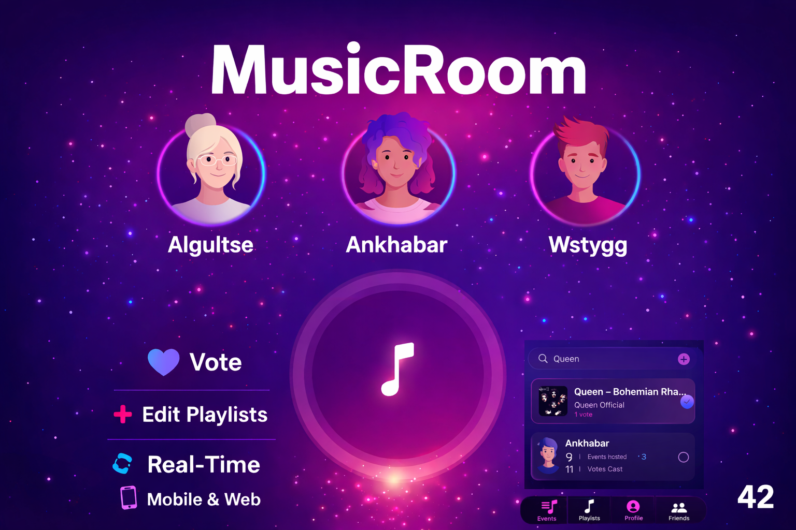
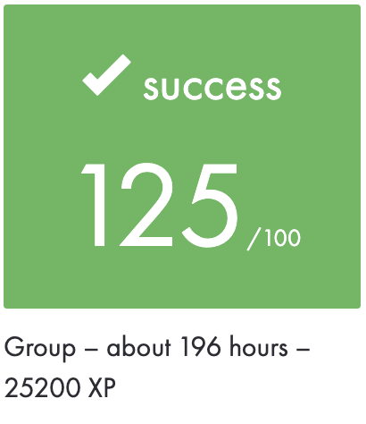
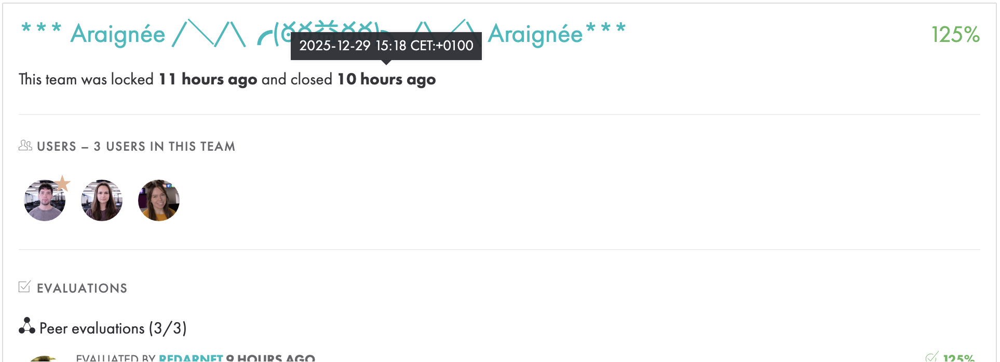
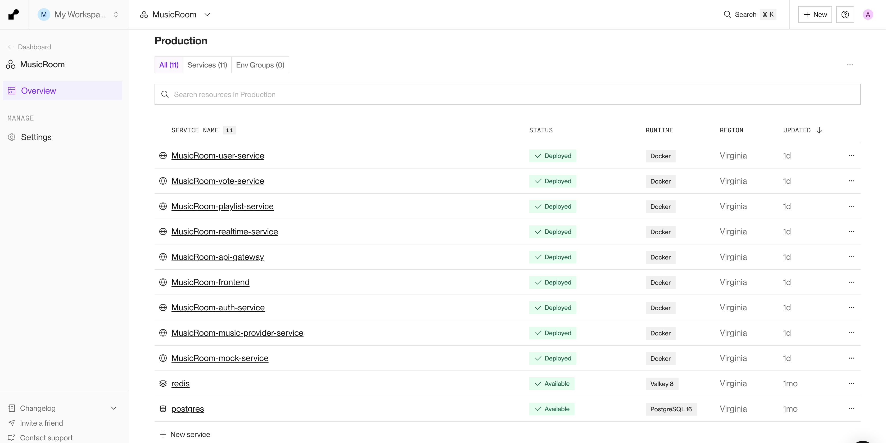
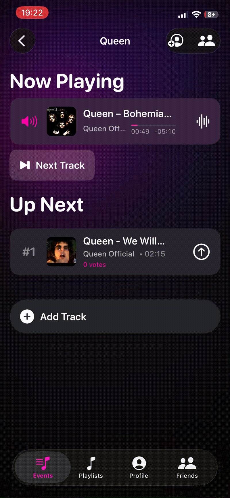
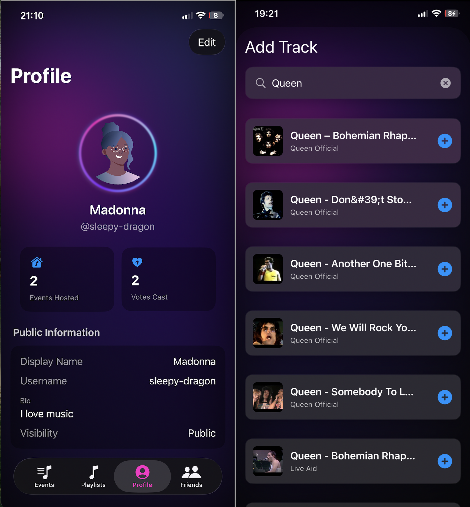
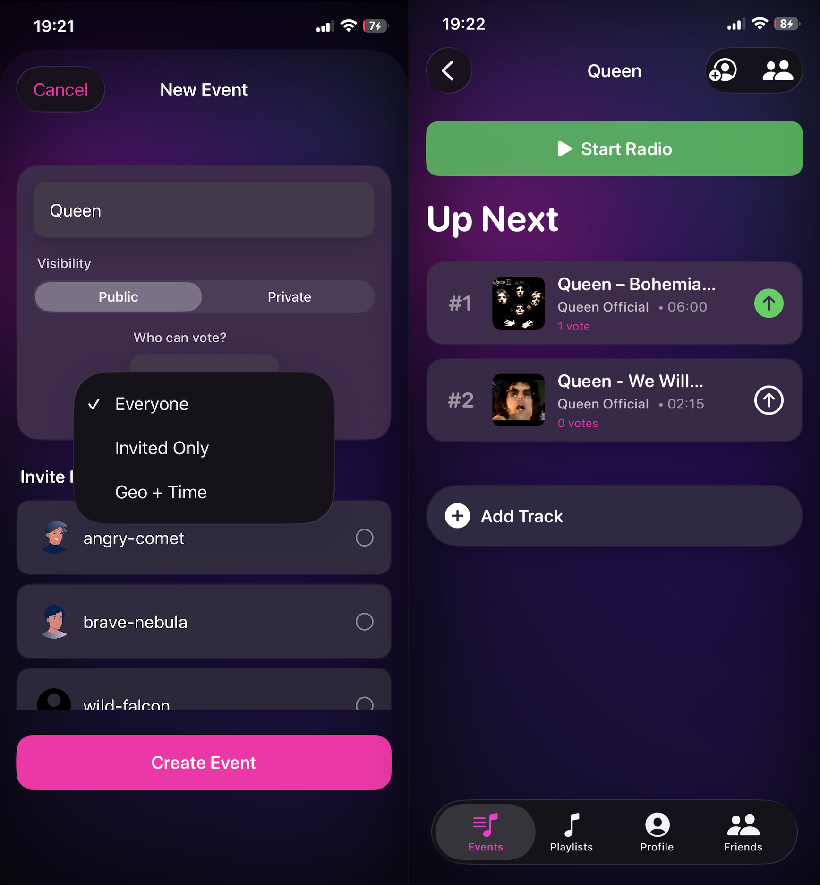
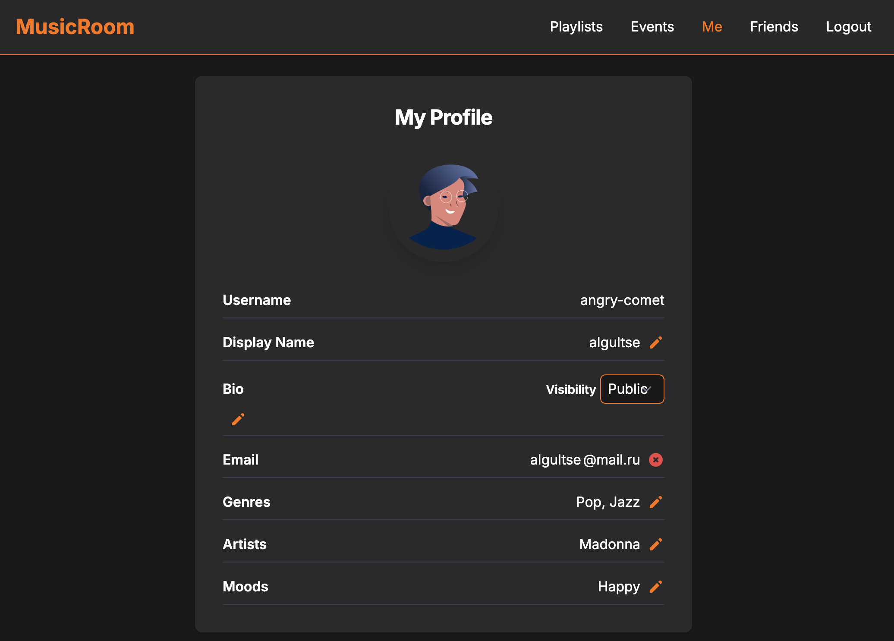
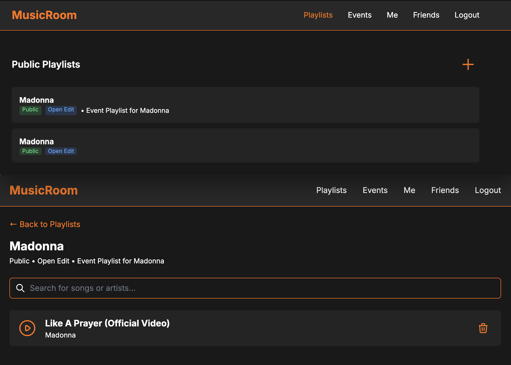

|           Grade          |                           |
|:------------------------:|:-------------------------:|
|  |  |
	

<br>

---

<details>
<summary>🇬🇧 ENGLISH VERSION</summary>

## Preamble
<a href="subject/Music_Room.en.subject.pdf">**MusicRoom**</a> is a collaborative music platform for sharing, voting, and editing **playlists in real time**.

The project is built on a microservices architecture, uses a documented `REST` API, a real-time system based on `WebSocket`, a `web frontend`, and a `mobile iOS` application acting as a remote controller for the backend.

## Key Features
- Music `Track Vote`
  - Real-time voting to determine the next track to be played
- Music `Playlist Editor`
  - Real-time collaborative playlist editing
- Secure `Authentication`
  - JWT
  - OAuth (Google / 42)
  - Email verification & password reset
- `User Management`
  - Public / private profiles
  - Friends and invitations
  - Avatars
- `Visibility` & `License Management`
  - Public / private events
  - Restricted voting (invited users, geographic area, time window)
- `Real-Time` Features
  - Instant synchronization via WebSocket + Redis
- `Premium-Featured`
  - Personalized avatar generation using AI
- `Mobile-First`
  - iOS application acting as a remote controller

## Technologies
- Backend: `Go`
- API: `REST`
- DB: `PostgreSQL`
- Realtime: `WebSocket` + `Redis`
- Cache & Pub/Sub : `Redis`
- Auth : `JWT`, `OAuth`, `Email verification`
- Mobile: `Swift` (iOS)
- Frontend: `Go` + `HTML templates` + `Vanilla JS` + `CSS` (Tailwind)
- DevOps: `Docker`, `Microservices`

## Deployment
The project is deployed using `Render.com`.
**Web frontend** and the **iOS mobile application**
to connect :
- to a **localhost** during dev
- to a **remote production env** hosted on `Render`
  

  <details>
  <summary>Launch</summary>

  ## 1. Launch program
  ```bash
  git clone https://github.com/N0fish/MusicRoom.git
  cd MusicRoom
  ```

  ## 2. Start
  ```bash
  make env
  make up
  cd mobile
  make
  ```
   or
  ### env + up + url
  ```bash
  make start
  ```

  ## 3. Access the site
  `make url`
  ```bash
  http://<ip>:5175
  `or`
  http://localhost:5175
  ```

  ## 4. Stop containers docker
  ```bash
  make down
  ```
  </details>

</details>

---

<details>
<summary>🇫🇷 FRENCH VERSION</summary>

## Preamble
<a href="subject/Music_Room.en.subject.pdf">**MusicRoom**</a> est une plateforme musicale collaborative dédiée au partage, au vote et à l’édition de `playlists en temps réel`.

Le projet repose sur une architecture microservices, utilise une API `REST` documentée, un système temps réel basé sur `WebSocket`, un `frontend web` et une application `mobile iOS` servant de télécommande du backend.

## Key Features
- Music `Track Vote `
  - Vote en temps réel pour déterminer le prochain morceau joué
- Music `Playlist Editor`
  - Édition collaborative de playlists en temps réel
- `Authentification` sécurisée
  - JWT
  - OAuth (Google / 42)
  - Vérification email & reset password
- `Gestion des utilisateurs`
  - Profil public / privé
  - Amis et invitations
  - Avatars
- `Gestion de visibilité` et `licences`
  - Événements publics / privés
  - Votes restreints (invités, zone géographique, période temporelle)
- Temps `réel`
  - Synchronisation instantanée via WebSocket + Redis
- `Premium-fonctionnalités`
  - Génération d’avatar personnalisé via IA
- `Mobile-first`
  - Application iOS comme télécommande distante

## Technologies
- Backend: `Go`
- API: `REST`
- DB: `PostgreSQL`
- Realtime: `WebSocket` + `Redis`
- Cache & Pub/Sub : `Redis`
- Auth : `JWT`, `OAuth`, `Email verification`
- Mobile: `Swift` (iOS)
- Frontend: `Go` + `HTML templates` + `Vanilla JS` + `CSS` (Tailwind)
- DevOps: `Docker`, `Microservices`

## Déploiement
Le projet est déployé avec `Render.com`.
**Frontend web** et à l’application **mobile iOS**
peux se connecter :
- à un env **localhost** de dev,
- soit à un env **de production distant** hébergé sur `Render`.
  

  <details>
  <summary>lancement</summary>

  ## 1. Programme de lancement
  ```bash
  git clone https://github.com/N0fish/MusicRoom.git
  cd MusicRoom
  ```

  ## 2. Start
  ```bash
  make env
  make up
  cd mobile
  make
  ```
  or
  ### env + up + url
  ```bash
  make start
  ```

  ## 3. Accéder au site
  `make url`
  ```bash
  http://<ip>:5175
  `or`
  http://localhost:5175
  ```

  ## 4. Stop containers docker
  ```bash
  make down
  ```
  </details>

</details>

---

<details>
<summary>🇷🇺 RUSSIAN VERSION</summary>

## Преамбула
<a href="subject/Music_Room.en.subject.pdf">**MusicRoom**</a> — это `музыкальная платформа` для совместного использования, голосования и редактирования плейлистов **в реальном времени**.

Проект построен на `микросервисной архитектуре`, использует документированный `REST` API, реалтайм-систему на базе `WebSocket`, `веб-фронтенд` и `мобильное iOS-приложение`, как пульт дистанционного управления бэкендом.

## Основные возможности
- `Голосование` за треки
  - Голосование в реальном времени для определения следующего трека
- `Редактор плейлистов`
  - Совместное редактирование плейлистов в реальном времени
- Безопасная `аутентификация`
  - JWT
  - OAuth (Google / 42)
  - Подтверждение email и сброс пароля
- `Управление пользователями`
  - Публичные / приватные профили
  - Друзья и приглашения
  - Аватары
- `Управление видимостью` и `лицензиями`
  - Публичные / приватные события
  - Ограниченное голосование (приглашённые пользователи, геозона, временное окно)
- `Реалтайм`
  - Мгновенная синхронизация через WebSocket + Redis
- `Премиум-функции`
  - Персонализированная генерация аватаров с помощью ИИ
- `Mobile-first`
  - iOS-приложение как дистанционный контроллер

## Технологии
- Backend: `Go`
- API: `REST`
- Realtime: `WebSocket` + `Redis`
- DB: `PostgreSQL`
- Mobile: `Swift` (iOS)
- Frontend: `Go` + `HTML templates` + `Vanilla JS` + `CSS` (Tailwind)
- DevOps: `Docker`, `Microservices`

## Развёртывание
Проект сделан с использованием платформы `Render.com`.  
Веб-клиент и мобильное **iOS-приложение**
может работать:
- с **localhost** во время разработки,
- так и с **production-окружением**, размещённым на `Render`.  
  

  <details>
  <summary>Запуск</summary>

  ## 1. Запуск программы
  ```bash
  git clone https://github.com/N0fish/MusicRoom.git
  cd MusicRoom
  ```

  ## 2. Start
  ```bash
  make env
  make up
  cd mobile
  make
  ```
  or
  ### env + up + url
  ```bash
  make start
  ```

  ## 3. Доступ к сайту
  `make url`
  ```bash
  http://<ip>:5175
  `or`
  http://localhost:5175
  ```

  ## 4. Остановить докер контейнеры
  ```bash
  make down
  ```
  </details>

</details>

--- 

<br>

# MusicRoom — Go Microservices
Is a music platform that allows users to create events, edit playlists, vote for tracks, and listen to music in real time through web and mobile apps.
<details>
<summary>Architecture</summary>
Microservice architecture of a music application: authorization, playlists, voting, and realtime via WebSocket.

## Services Overview
| Service                    | Purpose                 | Port |
|----------------------------|-------------------------|------|
| **api-gateway**            | Single point of entry   | 8080 |
| **auth-service**           | Authorization / JWT     | 3001 |
| **user-service**           | Profiles & social       | 3005 |
| **playlist-service**       | Playlists and tracks    | 3002 |
| **vote-service**           | Events and voting       | 3003 |
| **realtime-service**       | WebSocket gateway       | 3004 |
| **mock-service**           | Mock / Testing          | 3006 |
| **music-provider-service** | External music search   | 3007 |
| **postgres**               | Shared database         | 5432 |
| **redis**                  | Pub/Sub messages        | 6379 |

```sql
┌────────────────────────────────┐   
│  Go Frontend Service           │   ┌────────────────────────────────┐
│    ├─ HTML templates (.gohtml) │   │     iOS Mobile App             │
│    ├─ CSS (Tailwind)           │   │       ├─ Swift (iOS)           │
│    ├─ JS (Vanilla)             │   └────────────────────────────────┘ 
└────────────────────────────────┘   
                           frontend/mobile                
                                  │
                     HTTP REST    │      WS (JWT)
                                  ▼  
                        Go Backend Service
           ┌──────────────────────────────────────┐
requests → │         API Gateway            :8080 │
           │ /auth           → auth-service       │ 
           │ /users          → user-service       │
           │ /playlists      → playlist-service   │         ┌───────────────────┐
           │ /events         → vote-service       │ /mock → │   mock-service    │
           │  /music/search  → music-provider     │         │             :3006 │
           └────────────┬─────────────────────────┘         └───────────────────┘
                        │ internal HTTP
          ┌─────────────┼──────────────┬───────────────┬──────────────────┐
          ↓             ↓              ↓               ↓                  ↓
   ┌────────────┐ ┌────────────┐ ┌────────────┐ ┌────────────┐     ┌──────────────────┐
   │auth-service│ │user-service│ │playlist-s. │ │vote-service│→ ┬ ←│music-provider-s. │
   │      :3001 │ │      :3005 │ │      :3002 │ │      :3003 │  ↓  │            :3007 │
   └────┬───────┘ └────┬───────┘ └─────┬──────┘ └──────┬─────┘  ↓  └─────────┬────────┘
        │ SQL          │ SQL         ↓ │ SQL           │ SQL    ↓            │ HTTP
        └──────┬───────┴──────┬────────┴─────┬─────────┐        ↓            ▼
               │              │      ↓       │         │        ↓         ┌──────────────┐
               ▼              ▼      ↓       ▼         ▼        ↓         │ External API │
         ┌──────────────────────────────────────────────┐       ↓         │ (YouTube...) │
         │               Postgres :5432                 │       ↓         └──────────────┘
         └──────────────────────────────────────────────┘       ↓
                                     ↓                          ↓
                                     ↓                          ↓
                                     ↓                          ↓
                                     ↓                          ↓
                        ┌─────────────────────────────┐         ↓
                        │         Redis :6379         │← ← ← ← ←┘
                        │          pub/sub            │
                        └──────────────┬──────────────┘
                                       │
                                       ▼
                                ┌───────────────┐
                                │realtime-s. WS │
                                │         :3004 │
                                └───────────────┘
```
</details>

<details>
<summary>Useful links</summary>

- [apidoc-42](https://api.intra.42.fr/apidoc)
- [oauth/applications/new-42](https://profile.intra.42.fr/oauth/applications/new)
- [console.cloud.google](https://console.cloud.google.com)
- [swagger](https://editor.swagger.io)

</details>

---

## Authors
Backend · Mobile · Web frontend · API · Realtime · Security · DevOps · Architecture · Bonus IA · etc.  

Made with by:
- [algultse](https://github.com/N0fish) - Developer
- [wstygg](https://github.com/TheWeaklessOne) - Mobile
- [ankhabar](https://github.com/UrbanSamuraii) - Frontend

|                                           |                                            |
|:-----------------------------------------:|:------------------------------------------:|
|  |  |
|     |             |
|    | |

> This project was developed as a team collaboration at Ecole 42 in December 2025.
